# Design Document: Music Player Plugin

## Overview

An intelligent music player plugin for IDEs (primarily IntelliJ IDEA, with optional VS Code support) that combines high-quality audio playback with AI-powered music discovery, recommendation, and contextual information. The system integrates local music library management with QQ Music streaming, providing developers with an immersive music experience tailored to their coding context and emotional state.

## Architecture

### System Components

```mermaid
graph TB
    subgraph IDE["IDE Plugin Layer (Java/Kotlin)"]
        UI[UI Layer Components]
        KB[Keyboard Shortcuts]
        LC[Lifecycle Manager]
    end
    
    FFI[JNI/FFI Bridge]
    
    subgraph RUST["Rust Audio Core (Native Library)"]
        PC[Playback Controller]
        PM[Playlist Manager]
        SM[State Manager]
        
        subgraph ENGINE["HiFi Audio Engine (Rust)"]
            direction LR
            SYMP[Symphonia<br/>Decoding] --> CPAL[cpal<br/>Hardware Access]
            CPAL --> FLOAT[64-bit Float<br/>Processing]
            FLOAT --> ZERO[Zero-Copy<br/>Buffers]
            CUE[CUE Parser<br/>Sample-accurate seeking]
        end
    end
    
    subgraph AI["AI & Intelligence Layer"]
        REC[Recommendation Engine]
        EMO[Emotion Analyzer]
        CHAT[Chat Interface]
        CLASS[AI Classifier & Context Generator]
    end
    
    subgraph DATA["Data & Integration Layer"]
        SCRAPER[Music Scraper]
        QQ[QQ Music API]
        CTX[Context Generator]
    end
    
    UI --> FFI
    KB --> FFI
    LC --> FFI
    
    FFI --> PC
    FFI --> PM
    FFI --> SM
    
    PC --> ENGINE
    PM --> ENGINE
    
    ENGINE --> REC
    ENGINE --> EMO
    ENGINE --> CHAT
    
    REC --> CLASS
    EMO --> CLASS
    CHAT --> CLASS
    
    CLASS --> SCRAPER
    CLASS --> CTX
    CLASS --> QQ
```



### Component Descriptions

#### 1. IDE Plugin Layer
- **UI Components**: Renders the music player interface within the IDE
- **Keyboard Shortcuts**: Manages hotkey bindings for playback control
- **Lifecycle Manager**: Handles plugin initialization, shutdown, and state persistence

#### 2. Rust Audio Core (Native Library)
- **Playback Controller**: Manages play, pause, stop, seek, next, previous operations
- **Playlist Manager**: Handles playlist CRUD operations and track ordering
- **State Manager**: Maintains current playback state, volume, and user preferences
- **CUE Parser**: Parses CUE sheet files and manages virtual track boundaries
- **HiFi Audio Engine**: Professional-grade audio decoding and playback
  - **Symphonia**: Universal media demuxing and decoding for all formats
  - **cpal**: Cross-platform low-latency audio I/O
  - **64-bit Float Processing**: Maintains maximum precision throughout pipeline
  - **Zero-Copy Buffers**: Lock-free ring buffers for efficient data flow
  - **Exclusive Mode Support**: Direct hardware access for bit-perfect playback
  - **Precise Seeking**: Sample-accurate positioning for CUE track boundaries

#### 3. AI & Intelligence Layer
- **Recommendation Engine**: Generates music suggestions based on context and emotions
- **Emotion Analyzer**: Monitors user behavior to infer mood and work state
- **Chat Interface**: Natural language processing for music requests
- **AI Classifier**: Analyzes audio characteristics for genre, mood, and energy classification
- **Context Generator**: Creates rich contextual information and visual content

#### 4. Data & Integration Layer
- **Music Scraper**: Indexes local music files and fetches metadata
- **QQ Music API**: Integrates with QQ Music streaming service
- **Context Generator**: Produces background information and generated imagery

## Source Code Organization

### Project Structure

The project follows a monorepo structure with clear separation between Rust core and IDE plugin layers:

```
contexture/
├── Cargo.toml                    # Rust workspace configuration
├── README.md                     # Project documentation
├── LICENSE                       # License file
│
├── core/                         # Rust audio core library
│   ├── Cargo.toml               # Core library dependencies
│   ├── src/
│   │   ├── lib.rs               # Library entry point
│   │   ├── audio/               # Audio engine module
│   │   │   ├── mod.rs
│   │   │   ├── engine.rs        # Main audio engine
│   │   │   ├── decoder.rs       # Audio decoding (Symphonia)
│   │   │   ├── output.rs        # Audio output (cpal)
│   │   │   ├── buffer.rs        # Ring buffer implementation
│   │   │   ├── processor.rs     # 64-bit float processing
│   │   │   └── format.rs        # Format detection
│   │   │
│   │   ├── cue/                 # CUE sheet parsing
│   │   │   ├── mod.rs
│   │   │   ├── parser.rs        # CUE file parser
│   │   │   ├── sheet.rs         # CUE sheet data structures
│   │   │   └── virtual_track.rs # Virtual track creation
│   │   │
│   │   ├── playlist/            # Playlist management
│   │   │   ├── mod.rs
│   │   │   ├── manager.rs       # Playlist CRUD operations
│   │   │   ├── queue.rs         # Playback queue
│   │   │   └── smart.rs         # Smart playlist logic
│   │   │
│   │   ├── library/             # Music library management
│   │   │   ├── mod.rs
│   │   │   ├── scanner.rs       # File system scanner
│   │   │   ├── metadata.rs      # Metadata extraction
│   │   │   ├── database.rs      # SQLite database
│   │   │   └── indexer.rs       # Search indexing
│   │   │
│   │   ├── ai/                  # AI classification
│   │   │   ├── mod.rs
│   │   │   ├── classifier.rs    # Audio classification
│   │   │   ├── features.rs      # Feature extraction
│   │   │   └── model.rs         # ML model inference
│   │   │
│   │   ├── streaming/           # Streaming integration
│   │   │   ├── mod.rs
│   │   │   ├── qq_music.rs      # QQ Music API client
│   │   │   └── http.rs          # HTTP streaming
│   │   │
│   │   ├── ffi/                 # FFI interface
│   │   │   ├── mod.rs
│   │   │   ├── c_api.rs         # C-compatible API
│   │   │   ├── jni.rs           # JNI bindings
│   │   │   └── types.rs         # FFI type conversions
│   │   │
│   │   ├── state/               # State management
│   │   │   ├── mod.rs
│   │   │   ├── playback.rs      # Playback state
│   │   │   └── persistence.rs   # State persistence
│   │   │
│   │   └── error.rs             # Error types
│   │
│   ├── tests/                   # Integration tests
│   │   ├── audio_quality.rs     # Audio quality tests
│   │   ├── bit_perfect_verification.rs
│   │   ├── ffi_integration.rs   # FFI safety tests
│   │   ├── cue_parser_comprehensive.rs
│   │   └── cue_seeking_accuracy.rs
│   │
│   ├── benches/                 # Performance benchmarks
│   │   └── audio_pipeline.rs    # Audio pipeline benchmarks
│   │
│   └── examples/                # Usage examples
│       ├── simple_playback.rs
│       └── cue_playback.rs
│
├── plugin/                      # IntelliJ IDEA plugin
│   ├── build.gradle.kts         # Gradle build configuration
│   ├── settings.gradle.kts
│   ├── gradle.properties
│   │
│   ├── src/
│   │   ├── main/
│   │   │   ├── kotlin/
│   │   │   │   └── com/musicplayer/
│   │   │   │       ├── MusicPlayerPlugin.kt      # Plugin entry point
│   │   │   │       │
│   │   │   │       ├── audio/                    # Audio integration
│   │   │   │       │   ├── RustAudioEngine.kt    # JNI wrapper
│   │   │   │       │   ├── PlaybackController.kt
│   │   │   │       │   └── AudioState.kt
│   │   │   │       │
│   │   │   │       ├── ui/                       # User interface
│   │   │   │       │   ├── PlayerPanel.kt        # Main player UI
│   │   │   │       │   ├── PlaylistView.kt
│   │   │   │       │   ├── LibraryView.kt
│   │   │   │       │   ├── ChatPanel.kt
│   │   │   │       │   └── ContextInfoPanel.kt
│   │   │   │       │
│   │   │   │       ├── actions/                  # IDE actions
│   │   │   │       │   ├── PlayPauseAction.kt
│   │   │   │       │   ├── NextTrackAction.kt
│   │   │   │       │   └── PreviousTrackAction.kt
│   │   │   │       │
│   │   │   │       ├── services/                 # Plugin services
│   │   │   │       │   ├── PlaybackService.kt
│   │   │   │       │   ├── PlaylistService.kt
│   │   │   │       │   └── LibraryService.kt
│   │   │   │       │
│   │   │   │       ├── settings/                 # Settings
│   │   │   │       │   ├── MusicPlayerSettings.kt
│   │   │   │       │   └── SettingsConfigurable.kt
│   │   │   │       │
│   │   │   │       └── utils/                    # Utilities
│   │   │   │           ├── NativeLibraryLoader.kt
│   │   │   │           └── StateSerializer.kt
│   │   │   │
│   │   │   └── resources/
│   │   │       ├── META-INF/
│   │   │       │   └── plugin.xml               # Plugin manifest
│   │   │       ├── icons/                       # UI icons
│   │   │       └── messages/                    # i18n messages
│   │   │
│   │   └── test/
│   │       └── kotlin/
│   │           └── com/musicplayer/
│   │               ├── audio/
│   │               │   └── RustAudioEngineTest.kt
│   │               └── ui/
│   │                   └── PlayerPanelTest.kt
│   │
│   └── libs/                    # Native libraries
│       ├── linux-x64/
│       ├── windows-x64/
│       └── macos-x64/
│
├── scripts/                     # Build and utility scripts
│   ├── ci-local.sh             # Local CI script
│   ├── build-native.sh         # Build native libraries
│   └── generate-test-audio.sh  # Generate test audio files
│
├── test_data/                   # Test data
│   ├── audio/                  # Test audio files
│   ├── cue_corpus/             # CUE test files
│   └── reference/              # Reference files for quality tests
│
├── docs/                        # Documentation
│   ├── architecture.md
│   ├── api.md
│   ├── ci-cd.md
│   └── development.md
│
└── .github/                     # GitHub configuration
    ├── workflows/              # CI/CD workflows
    │   ├── ci.yml
    │   ├── performance.yml
    │   └── release.yml
    └── ISSUE_TEMPLATE/
```

### Module Responsibilities

#### Rust Core Modules

**`audio/`** - Audio Engine
- `engine.rs`: Main audio engine orchestration, playback control
- `decoder.rs`: Audio decoding using Symphonia, format support
- `output.rs`: Audio output using cpal, device management, exclusive mode
- `buffer.rs`: Lock-free ring buffer, zero-copy data flow
- `processor.rs`: 64-bit float processing, volume control, sample rate conversion
- `format.rs`: Audio format detection and validation

**`cue/`** - CUE Sheet Support
- `parser.rs`: CUE file parsing using nom, encoding detection
- `sheet.rs`: CUE sheet data structures (CueSheet, CueTrack, CueFile)
- `virtual_track.rs`: Virtual track creation, time range mapping

**`playlist/`** - Playlist Management
- `manager.rs`: Playlist CRUD operations, persistence
- `queue.rs`: Playback queue management, shuffle/repeat logic
- `smart.rs`: Smart playlist criteria matching, auto-update

**`library/`** - Music Library
- `scanner.rs`: File system scanning, recursive directory traversal
- `metadata.rs`: Metadata extraction from audio files
- `database.rs`: SQLite database operations, schema management
- `indexer.rs`: Full-text search indexing, query optimization

**`ai/`** - AI Classification
- `classifier.rs`: Genre, mood, energy classification
- `features.rs`: Audio feature extraction (tempo, instrumentation)
- `model.rs`: ML model loading and inference

**`streaming/`** - Streaming Services
- `qq_music.rs`: QQ Music API client, authentication, search
- `http.rs`: HTTP streaming, adaptive bitrate

**`ffi/`** - Foreign Function Interface
- `c_api.rs`: C-compatible API definitions, memory safety
- `jni.rs`: JNI bindings for Java/Kotlin integration
- `types.rs`: Type conversions between Rust and C/Java

**`state/`** - State Management
- `playback.rs`: Playback state tracking (position, volume, status)
- `persistence.rs`: State serialization and restoration

#### Plugin Modules (Kotlin)

**`audio/`** - Audio Integration
- `RustAudioEngine.kt`: JNI wrapper for Rust audio core
- `PlaybackController.kt`: High-level playback control
- `AudioState.kt`: Audio state management

**`ui/`** - User Interface
- `PlayerPanel.kt`: Main player interface with controls
- `PlaylistView.kt`: Playlist display and management
- `LibraryView.kt`: Music library browser
- `ChatPanel.kt`: AI chat interface
- `ContextInfoPanel.kt`: Contextual information display

**`actions/`** - IDE Actions
- Keyboard shortcut handlers
- Menu action implementations
- Toolbar button actions

**`services/`** - Plugin Services
- Background services for playback, library scanning
- IDE lifecycle integration
- State persistence

**`settings/`** - Configuration
- Plugin settings UI
- Preference storage
- Configuration validation

### Naming Conventions

**Rust**
- Modules: `snake_case` (e.g., `audio_engine`, `cue_parser`)
- Types: `PascalCase` (e.g., `AudioEngine`, `CueSheet`)
- Functions: `snake_case` (e.g., `create_engine`, `parse_cue_file`)
- Constants: `SCREAMING_SNAKE_CASE` (e.g., `MAX_BUFFER_SIZE`)
- FFI functions: `extern "C" fn` with `#[no_mangle]` and C naming

**Kotlin**
- Classes: `PascalCase` (e.g., `MusicPlayerPlugin`, `PlaybackController`)
- Functions: `camelCase` (e.g., `playTrack`, `pausePlayback`)
- Properties: `camelCase` (e.g., `currentTrack`, `isPlaying`)
- Constants: `SCREAMING_SNAKE_CASE` (e.g., `MAX_VOLUME`)

### File Organization Principles

1. **Separation of Concerns**: Each module has a single, well-defined responsibility
2. **Layered Architecture**: Clear boundaries between audio, business logic, and UI layers
3. **Testability**: Each module is independently testable with clear interfaces
4. **FFI Boundary**: All FFI code isolated in `ffi/` module for safety
5. **Platform Abstraction**: Platform-specific code clearly marked and isolated

### Build Artifacts

**Rust Core**
- `libmusic_player_core.so` (Linux)
- `music_player_core.dll` (Windows)
- `libmusic_player_core.dylib` (macOS)

**Plugin**
- `music-player-plugin.zip` (IntelliJ plugin distribution)

## Design Decisions

### Decision 1: Rust Technology Stack for Audio Core
**Rationale**: Rust is chosen as the primary technology for the audio processing core to achieve HiFi-grade audio quality:
- **Zero-cost abstractions**: No runtime overhead for high-level code
- **Memory safety without garbage collection**: Eliminates GC pauses that could cause audio glitches
- **Precise control over audio buffer management**: Critical for bit-perfect playback
- **Excellent audio library ecosystem**: Symphonia, cpal, rodio provide professional-grade audio processing
- **Cross-platform native performance**: Consistent HiFi quality across operating systems
- **Fearless concurrency**: Safe multi-threading for audio processing without data races

**Implementation**: Core audio engine written in Rust, exposed via FFI to IDE plugin layer (Java/Kotlin for IntelliJ, TypeScript for VS Code).

**Trade-offs**: Requires FFI bridge between Rust core and IDE plugin layer, but the audio quality benefits far outweigh the integration complexity.

### Decision 2: Plugin-Based Architecture with Rust Core
**Rationale**: A hybrid architecture combines IDE plugin integration with a high-performance Rust audio core:
- Clean separation: IDE integration layer (Java/Kotlin) + Audio core (Rust)
- Easy installation and updates through IDE plugin managers
- Minimal impact on IDE performance
- HiFi audio processing isolated from IDE runtime

**Implementation**: 
- Rust library compiled as native shared library (.so/.dylib/.dll)
- JNI/FFI bridge for communication between Java and Rust
- Plugin layer handles UI and IDE integration
- Rust core handles all audio processing

### Decision 3: Bit-Perfect Audio Pipeline
**Rationale**: To achieve HiFi-grade audio quality, the entire audio pipeline must preserve bit-perfect accuracy:
- **No resampling**: Output at native sample rate when possible
- **No dithering**: Preserve original bit depth
- **Direct hardware access**: Bypass OS audio mixers when available (WASAPI Exclusive, ALSA Direct)
- **Minimal processing**: Only essential volume control in 64-bit float precision
- **Gapless playback**: Zero-latency track transitions

**Implementation**: 
- Use `cpal` for low-latency hardware access
- Implement exclusive mode for Windows (WASAPI) and Linux (ALSA)
- 64-bit floating-point internal processing
- Hardware volume control when available

### Decision 2: Streaming-Based Audio Processing with Zero-Copy
**Rationale**: Stream and decode audio with zero-copy optimizations:
- Reduces memory footprint significantly
- Enables playback of large lossless files without delays
- Allows for responsive seeking operations
- Supports efficient resource cleanup
- Zero-copy buffer passing between decoder and output

**Implementation**: The Audio Engine will maintain a lock-free ring buffer (2-5 seconds) of decoded audio data using Rust's ownership system for safe concurrent access.

### Decision 3: Symphonia as Single Decoding Backend
**Rationale**: Use Symphonia exclusively for all audio decoding needs:
- **Pure Rust implementation**: Memory safety, no C dependencies
- **Comprehensive format support**: FLAC, WAV, MP3, AAC, OGG, ALAC - covers 95%+ of use cases
- **High-quality decoding**: Professional-grade audio quality
- **Active maintenance**: Well-maintained by the Rust audio community
- **Modular design**: Enable only needed formats to reduce binary size

**Supported Formats**:
- Lossless: FLAC, WAV, AIFF, ALAC
- Lossy: MP3, AAC/M4A, OGG/Vorbis
- Containers: MP4, MKV, WebM, CAF

**Unsupported Formats**:
- APE (Monkey's Audio): Low usage rate (<10%), requires FFmpeg C dependency
- Users can convert APE to FLAC for compatibility

**Trade-offs**: Simplified architecture and pure Rust stack outweigh the loss of APE support.

### Decision 4: Local-First AI Processing with Privacy Guarantees
**Rationale**: All emotion analysis and behavioral monitoring occurs locally without transmitting data externally. This design:
- Protects user privacy by keeping all behavioral data on the user's machine
- Reduces latency for real-time recommendations
- Eliminates dependency on external AI services
- Builds user trust through transparent data handling
- Complies with privacy regulations (GDPR, CCPA)
- Allows users to disable emotion analysis entirely

**Implementation**: 
- All emotion analysis runs in local Rust processes
- Behavioral data never leaves the user's machine
- No telemetry or analytics sent to external servers
- User preferences stored locally with encryption
- Clear privacy controls in settings

**Trade-offs**: Local processing may be less sophisticated than cloud-based AI, but privacy concerns and user trust outweigh this limitation.

### Decision 5: Hybrid Music Source Architecture
**Rationale**: Supporting both local files and QQ Music streaming provides flexibility:
- Users can enjoy their existing music collection
- Access to vast streaming library when needed
- Seamless integration between sources in playlists
- Graceful fallback if streaming is unavailable

**Implementation**: Abstract music source interface with concrete implementations for local files and QQ Music API.

### Decision 6: Progressive Metadata Enhancement
**Rationale**: Metadata is fetched and enhanced asynchronously to avoid blocking the UI:
- Initial scan extracts embedded metadata quickly
- Background process fetches additional information from online databases
- AI classification runs as a lower-priority background task
- UI updates progressively as more information becomes available

### Decision 7: IntelliJ IDEA as Primary Target
**Rationale**: Focusing on IntelliJ IDEA first allows us to:
- Leverage a mature plugin ecosystem
- Target a well-defined developer audience
- Utilize robust IDE APIs for integration
- Establish a solid foundation before expanding to other IDEs

**Future Expansion**: VS Code support can be added later using a similar architecture with platform-specific adapters.

### Decision 8: CUE Sheet Support for Album Collections
**Rationale**: CUE sheet support is essential for HiFi enthusiasts who store albums as single lossless files:
- **Common format**: Many lossless albums are distributed as single FLAC/WAV + CUE
- **Preserves album integrity**: Maintains the original continuous recording
- **Metadata richness**: CUE files contain detailed track information
- **Virtual track splitting**: No need to physically split audio files

**Implementation**:
- Parse CUE files to extract track boundaries and metadata
- Create virtual tracks that reference time ranges in the source audio file
- Support both single-file and multi-file CUE references
- Sample-accurate seeking to track start positions
- Automatic track end detection based on CUE timestamps

**Trade-offs**: Requires precise seek implementation and careful buffer management at track boundaries, but provides superior user experience for album playback.

## Entity Relationship Diagram

The following ER diagram illustrates the relationships between key entities in the music player system:


### Key Relationships

1. **Track ↔ Playlist**: Many-to-many relationship through PlaylistTrack junction table, allowing tracks to appear in multiple playlists
2. **Track ↔ CueSheet**: One-to-one optional relationship for virtual tracks created from CUE sheets
3. **CueSheet ↔ CueTrack/CueFile**: One-to-many relationships representing the parsed structure of a CUE sheet
4. **PlaybackState ↔ Track/Playlist**: References the currently playing track and its source playlist
5. **UserContext → MusicRecommendation**: User context influences recommendation generation
6. **Track → MusicRecommendation**: Recommendations are generated for specific tracks with contextual information
7. **Playlist ↔ PlaylistCriteria**: Smart playlists have criteria that automatically filter tracks

## Data Models

### Track
```typescript
interface Track {
  id: string;
  source: 'local' | 'qq_music' | 'cue_virtual';
  
  // Basic metadata
  title: string;
  artist: string;
  album: string;
  duration: number; // seconds
  
  // File information (local only)
  filePath?: string;
  format?: 'flac' | 'wav' | 'aiff' | 'alac' | 'mp3' | 'aac' | 'm4a' | 'ogg';
  bitrate?: number;
  sampleRate?: number;
  
  // CUE virtual track information
  cueSheet?: {
    cueFilePath: string;
    audioFilePath: string;
    trackNumber: number;
    startTime: number; // seconds with millisecond precision
    endTime?: number; // undefined means play to end of file
    pregapDuration?: number; // seconds
  };
  
  // Streaming information (QQ Music only)
  streamUrl?: string;
  qqMusicId?: string;
  
  // AI-generated metadata
  genre: string[];
  mood: string[];
  energy: number; // 0-100
  tempo: number; // BPM
  instrumentation: string[];
  hasVocals: boolean;
  
  // Additional metadata
  year?: number;
  coverArt?: string; // URL or base64
  lyrics?: string;
}
```

### CueSheet
```typescript
interface CueSheet {
  id: string;
  filePath: string;
  
  // Global metadata
  performer?: string; // Album artist
  title?: string; // Album title
  genre?: string;
  date?: string;
  comment?: string;
  
  // Audio files referenced by this CUE
  files: CueFile[];
  
  // Parsed tracks
  tracks: CueTrack[];
}

interface CueFile {
  fileName: string;
  fileType: 'WAVE' | 'MP3' | 'FLAC' | 'APE' | 'BINARY';
  resolvedPath: string; // Absolute path to audio file
}

interface CueTrack {
  trackNumber: number;
  type: 'AUDIO' | 'DATA';
  
  // Track metadata
  title: string;
  performer?: string;
  songwriter?: string;
  isrc?: string; // International Standard Recording Code
  
  // Timing information (in frames: 75 frames = 1 second)
  pregapFrames?: number;
  indexPoints: CueIndex[];
  
  // Reference to source file
  fileIndex: number; // Index in CueSheet.files array
}

interface CueIndex {
  indexNumber: number; // Usually 00 (pregap) or 01 (start)
  frames: number; // Position in frames from start of file
}
```

### Playlist
```typescript
interface Playlist {
  id: string;
  name: string;
  description?: string;
  createdAt: Date;
  updatedAt: Date;
  
  tracks: string[]; // Track IDs in order
  
  // Smart playlist criteria (optional)
  isSmartPlaylist: boolean;
  criteria?: {
    genres?: string[];
    moods?: string[];
    energyRange?: [number, number];
    tempoRange?: [number, number];
    hasVocals?: boolean;
    instrumentation?: string[];
    maxTracks?: number;
    sortBy?: 'energy' | 'tempo' | 'recent' | 'random';
    autoUpdate?: boolean; // Automatically refresh based on new classifications
  };
}
```

### PlaybackState
```typescript
interface PlaybackState {
  status: 'playing' | 'paused' | 'stopped';
  currentTrack: string | null; // Track ID
  currentPlaylist: string | null; // Playlist ID
  position: number; // seconds
  volume: number; // 0-100
  isMuted: boolean;
  repeatMode: 'none' | 'one' | 'all';
  shuffleEnabled: boolean;
}
```

### UserContext
```typescript
interface UserContext {
  timestamp: Date;
  
  // Behavioral indicators
  typingSpeed: number; // characters per minute
  errorRate: number; // compilation errors per hour
  breakFrequency: number; // breaks per hour
  sessionDuration: number; // minutes
  
  // Temporal context
  timeOfDay: 'morning' | 'afternoon' | 'evening' | 'night';
  dayOfWeek: string;
  
  // Inferred state
  inferredMood: string;
  stressLevel: number; // 0-100
  focusLevel: number; // 0-100
  isInFlowState: boolean;
}
```

### MusicRecommendation
```typescript
interface MusicRecommendation {
  track: Track;
  confidence: number; // 0-1
  reasoning: string;
  
  // Contextual information
  contextualInfo: {
    musicType: 'classical' | 'modern' | 'other';
    background: string; // Historical/cultural context
    relevance: string; // Why it matches current context
    visualContent: string; // URL to generated image
    
    // Classical music specific details
    classicalDetails?: {
      composer: string;
      compositionYear?: number;
      musicalPeriod?: string; // Baroque, Classical, Romantic, etc.
      musicalSignificance: string;
      movementInfo?: string;
    };
    
    // Modern music specific details
    modernDetails?: {
      artistBackground: string;
      songMeaning: string;
      culturalContext?: string;
      productionDetails?: string;
      releaseYear?: number;
    };
  };
}
```

## API Specifications

### Rust Core API (Exposed via FFI)

The Rust audio core exposes a C-compatible FFI interface for integration with the IDE plugin layer:

```rust
// Core audio engine interface
#[repr(C)]
pub struct AudioEngine {
    // Opaque pointer to internal state
}

// Playback control functions
#[no_mangle]
pub extern "C" fn audio_engine_create() -> *mut AudioEngine;

#[no_mangle]
pub extern "C" fn audio_engine_destroy(engine: *mut AudioEngine);

#[no_mangle]
pub extern "C" fn audio_engine_load(engine: *mut AudioEngine, path: *const c_char) -> i32;

#[no_mangle]
pub extern "C" fn audio_engine_play(engine: *mut AudioEngine) -> i32;

#[no_mangle]
pub extern "C" fn audio_engine_pause(engine: *mut AudioEngine) -> i32;

#[no_mangle]
pub extern "C" fn audio_engine_stop(engine: *mut AudioEngine) -> i32;

#[no_mangle]
pub extern "C" fn audio_engine_seek(engine: *mut AudioEngine, position_ms: u64) -> i32;

#[no_mangle]
pub extern "C" fn audio_engine_set_volume(engine: *mut AudioEngine, volume: f32) -> i32;

#[no_mangle]
pub extern "C" fn audio_engine_get_position(engine: *mut AudioEngine) -> u64;

#[no_mangle]
pub extern "C" fn audio_engine_get_duration(engine: *mut AudioEngine) -> u64;

// Audio quality settings
#[no_mangle]
pub extern "C" fn audio_engine_set_exclusive_mode(engine: *mut AudioEngine, enabled: bool) -> i32;

#[no_mangle]
pub extern "C" fn audio_engine_get_sample_rate(engine: *mut AudioEngine) -> u32;

#[no_mangle]
pub extern "C" fn audio_engine_get_bit_depth(engine: *mut AudioEngine) -> u32;

// Callback registration
#[no_mangle]
pub extern "C" fn audio_engine_set_state_callback(
    engine: *mut AudioEngine,
    callback: extern "C" fn(state: i32, user_data: *mut c_void),
    user_data: *mut c_void
) -> i32;
```

### Java/Kotlin JNI Wrapper

```kotlin
class RustAudioEngine {
    private var nativeHandle: Long = 0
    
    external fun create(): Long
    external fun destroy(handle: Long)
    external fun load(handle: Long, path: String): Int
    external fun play(handle: Long): Int
    external fun pause(handle: Long): Int
    external fun stop(handle: Long): Int
    external fun seek(handle: Long, positionMs: Long): Int
    external fun setVolume(handle: Long, volume: Float): Int
    external fun getPosition(handle: Long): Long
    external fun getDuration(handle: Long): Long
    external fun setExclusiveMode(handle: Long, enabled: Boolean): Int
    external fun getSampleRate(handle: Long): Int
    external fun getBitDepth(handle: Long): Int
    
    companion object {
        init {
            System.loadLibrary("music_player_core")
        }
    }
}
```

### Playback Controller API

```typescript
interface PlaybackController {
  // Basic controls
  play(): Promise<void>;
  pause(): Promise<void>;
  stop(): Promise<void>;
  seek(position: number): Promise<void>;
  next(): Promise<void>;
  previous(): Promise<void>;
  
  // Volume control
  setVolume(level: number): void;
  mute(): void;
  unmute(): void;
  
  // State queries
  getState(): PlaybackState;
  getCurrentTrack(): Track | null;
  
  // Event listeners
  onStateChange(callback: (state: PlaybackState) => void): void;
  onTrackChange(callback: (track: Track) => void): void;
  onError(callback: (error: Error) => void): void;
}
```

### Playlist Manager API

```typescript
interface PlaylistManager {
  // CRUD operations
  createPlaylist(name: string, description?: string): Promise<Playlist>;
  getPlaylist(id: string): Promise<Playlist | null>;
  updatePlaylist(id: string, updates: Partial<Playlist>): Promise<Playlist>;
  deletePlaylist(id: string): Promise<void>;
  listPlaylists(): Promise<Playlist[]>;
  
  // Track management
  addTracks(playlistId: string, trackIds: string[]): Promise<void>;
  removeTracks(playlistId: string, trackIds: string[]): Promise<void>;
  reorderTracks(playlistId: string, newOrder: string[]): Promise<void>;
  
  // Smart playlists
  createSmartPlaylist(name: string, criteria: PlaylistCriteria): Promise<Playlist>;
  refreshSmartPlaylist(playlistId: string): Promise<void>;
}
```

### Audio Engine API (Rust Internal)

```rust
pub trait AudioEngine {
    // Format support
    fn supported_formats(&self) -> Vec<String>;
    fn can_play(&self, file_path: &Path) -> bool;
    
    // Playback operations
    async fn load(&mut self, source: AudioSource) -> Result<()>;
    async fn play(&mut self) -> Result<()>;
    fn pause(&mut self);
    fn stop(&mut self);
    fn seek(&mut self, position: Duration) -> Result<()>;
    
    // Audio properties
    fn set_volume(&mut self, level: f32);
    fn get_volume(&self) -> f32;
    fn duration(&self) -> Duration;
    fn position(&self) -> Duration;
    
    // HiFi settings
    fn set_exclusive_mode(&mut self, enabled: bool) -> Result<()>;
    fn get_audio_info(&self) -> AudioInfo;
    
    // Event handlers
    fn on_ready(&mut self, callback: Box<dyn Fn() + Send>);
    fn on_progress(&mut self, callback: Box<dyn Fn(Duration) + Send>);
    fn on_ended(&mut self, callback: Box<dyn Fn() + Send>);
    fn on_error(&mut self, callback: Box<dyn Fn(Error) + Send>);
}

pub enum AudioSource {
    File(PathBuf),
    CueTrack {
        audio_file: PathBuf,
        start_time: Duration,
        end_time: Option<Duration>,
    },
    Stream(String),
}

pub struct AudioInfo {
    pub sample_rate: u32,
    pub bit_depth: u32,
    pub channels: u16,
    pub codec: String,
    pub is_lossless: bool,
}
```

### CUE Parser API (Rust Internal)

```rust
pub trait CueParser {
    // Parse CUE file
    fn parse_cue_file(&self, cue_path: &Path) -> Result<CueSheet>;
    
    // Validate CUE references
    fn validate_audio_files(&self, cue_sheet: &CueSheet) -> Result<Vec<ValidationError>>;
    
    // Convert CUE tracks to playable tracks
    fn create_virtual_tracks(&self, cue_sheet: &CueSheet) -> Result<Vec<Track>>;
    
    // Time conversion utilities
    fn frames_to_duration(&self, frames: u32) -> Duration;
    fn duration_to_frames(&self, duration: Duration) -> u32;
}

pub struct CueSheet {
    pub file_path: PathBuf,
    pub performer: Option<String>,
    pub title: Option<String>,
    pub genre: Option<String>,
    pub date: Option<String>,
    pub files: Vec<CueFile>,
    pub tracks: Vec<CueTrack>,
}

pub struct CueFile {
    pub file_name: String,
    pub file_type: CueFileType,
    pub resolved_path: PathBuf,
}

pub enum CueFileType {
    Wave,
    Mp3,
    Flac,
    Aiff,
    Binary,
}

pub struct CueTrack {
    pub track_number: u8,
    pub track_type: CueTrackType,
    pub title: String,
    pub performer: Option<String>,
    pub songwriter: Option<String>,
    pub isrc: Option<String>,
    pub pregap_frames: Option<u32>,
    pub indices: Vec<CueIndex>,
    pub file_index: usize,
}

pub enum CueTrackType {
    Audio,
    Data,
}

pub struct CueIndex {
    pub index_number: u8,
    pub frames: u32,
}

pub struct ValidationError {
    pub error_type: ValidationErrorType,
    pub message: String,
}

pub enum ValidationErrorType {
    MissingAudioFile,
    UnsupportedFormat,
    InvalidTimestamp,
    CorruptedCueFile,
}
```

### AI Classifier API

```typescript
interface AIClassifier {
  // Classification operations
  classifyTrack(track: Track): Promise<ClassificationResult>;
  batchClassify(tracks: Track[]): Promise<Map<string, ClassificationResult>>;
  
  // Learning and feedback
  provideFeedback(trackId: string, feedback: UserFeedback): void;
  improveModel(): Promise<void>;
}

interface ClassificationResult {
  genre: string[];
  mood: string[];
  energy: number;
  tempo: number;
  instrumentation: string[];
  hasVocals: boolean;
  confidence: number;
}
```

### Chat Interface API

```typescript
interface ChatInterface {
  // Message handling
  sendMessage(message: string): Promise<ChatResponse>;
  
  // Context management
  setUserContext(context: UserContext): void;
  clearHistory(): void;
}

interface ChatResponse {
  message: string;
  recommendations: MusicRecommendation[];
  actions?: PlaybackAction[];
}

interface PlaybackAction {
  type: 'play' | 'queue' | 'create_playlist';
  trackIds: string[];
}
```

### Context Generator API

```typescript
interface ContextGenerator {
  // Generate contextual information for recommendations
  generateContext(track: Track, userContext: UserContext): Promise<ContextualInfo>;
  
  // Generate visual content
  generateVisualContent(track: Track, mood: string): Promise<string>; // Returns image URL
  
  // Get detailed information
  getDetailedInfo(trackId: string): Promise<DetailedTrackInfo>;
}

interface ContextualInfo {
  musicType: 'classical' | 'modern' | 'other';
  background: string;
  relevance: string;
  visualContent: string;
  classicalDetails?: ClassicalMusicDetails;
  modernDetails?: ModernMusicDetails;
}

interface ClassicalMusicDetails {
  composer: string;
  compositionYear?: number;
  musicalPeriod?: string;
  musicalSignificance: string;
  movementInfo?: string;
  historicalContext?: string;
}

interface ModernMusicDetails {
  artistBackground: string;
  songMeaning: string;
  culturalContext?: string;
  productionDetails?: string;
  releaseYear?: number;
  influences?: string[];
}

interface DetailedTrackInfo {
  extendedBackground: string;
  relatedTracks: Track[];
  similarArtists?: string[];
  musicalAnalysis?: string;
  listeningNotes?: string;
}
```

### Recommendation Engine API

```typescript
interface RecommendationEngine {
  // Recommendation generation
  getRecommendations(context: UserContext, count: number): Promise<MusicRecommendation[]>;
  getContextualRecommendation(track: Track, context: UserContext): Promise<MusicRecommendation>;
  
  // Smart playlist generation based on AI classification
  generateSmartPlaylist(criteria: PlaylistCriteria, name: string): Promise<Playlist>;
  
  // Preference learning
  recordListeningHistory(trackId: string, duration: number, skipped: boolean): void;
  recordUserFeedback(trackId: string, rating: number): void;
}
```

### QQ Music API Integration

```typescript
interface QQMusicAPI {
  // Authentication
  authenticate(credentials: QQMusicCredentials): Promise<void>;
  isAuthenticated(): boolean;
  logout(): Promise<void>;
  
  // Search and discovery
  search(query: string, type: 'track' | 'artist' | 'album'): Promise<SearchResult[]>;
  getTrackDetails(trackId: string): Promise<Track>;
  
  // Streaming
  getStreamUrl(trackId: string): Promise<string>;
  
  // User library
  getUserPlaylists(): Promise<Playlist[]>;
  getUserFavorites(): Promise<Track[]>;
}
```

## User Interface Design

### Main Player Interface

The player interface will be a compact, non-intrusive panel that can be docked within the IDE:

```
┌─────────────────────────────────────────────────────────┐
│  ♪ Music Player                              [−][□][×]  │
├─────────────────────────────────────────────────────────┤
│                                                          │
│  [Album Art]    Title: Moonlight Sonata                 │
│   150x150       Artist: Ludwig van Beethoven            │
│                 Album: Piano Sonatas                    │
│                                                          │
│  ━━━━━━━━━━━━━━━━━━━━━━━━━━━━━━━━━━━━━━━━━━━━━━━━━━━  │
│  2:34 ────────────●──────────────────────── 14:52      │
│                                                          │
│     [⏮] [⏯] [⏹] [⏭]        🔊 ━━━━━●━━━━━ 75%        │
│                                                          │
│  💬 Chat  📋 Playlist  🎵 Library  ⚙️ Settings         │
└─────────────────────────────────────────────────────────┘
```

### Chat Interface

```
┌─────────────────────────────────────────────────────────┐
│  💬 Music Assistant                                      │
├─────────────────────────────────────────────────────────┤
│                                                          │
│  You: Play something energetic for coding               │
│                                                          │
│  Assistant: I've found some high-energy tracks that     │
│  match your coding flow. Here are my recommendations:   │
│                                                          │
│  🎵 "Vivaldi - Four Seasons: Summer"                    │
│     [▶ Play] [+ Queue] [ℹ More Info]                   │
│     Energy: 85 | Tempo: 140 BPM                         │
│                                                          │
│  🎵 "Two Steps From Hell - Heart of Courage"            │
│     [▶ Play] [+ Queue] [ℹ More Info]                   │
│     Energy: 92 | Tempo: 145 BPM                         │
│                                                          │
│  ┌────────────────────────────────────────────┐         │
│  │ Type your message...                       │         │
│  └────────────────────────────────────────────┘  [Send] │
└─────────────────────────────────────────────────────────┘
```

### Contextual Information Display

When a recommendation is made, rich contextual information is displayed:

```
┌─────────────────────────────────────────────────────────┐
│  🎼 Now Playing: Moonlight Sonata (1st Movement)        │
├─────────────────────────────────────────────────────────┤
│                                                          │
│  [Generated Artistic Image]                             │
│  Moonlit scene with piano silhouette                    │
│                                                          │
│  📖 Background                                           │
│  Composed by Ludwig van Beethoven in 1801, the          │
│  "Moonlight Sonata" is one of the most famous piano     │
│  compositions. The first movement features a haunting   │
│  melody that evokes contemplation and introspection.    │
│                                                          │
│  🎯 Why This Matches Your Context                       │
│  Based on your current late-night coding session and    │
│  steady typing rhythm, this piece provides a calming    │
│  yet focused atmosphere. The consistent tempo and       │
│  minimal variation help maintain concentration.         │
│                                                          │
│  [Show More Details] [Similar Music] [Save to Playlist] │
└─────────────────────────────────────────────────────────┘
```

## Implementation Strategy

### Phase 1: Rust Audio Core Foundation
1. Set up Rust project structure with FFI exports
2. Implement basic audio engine using `cpal` for output
3. Integrate `symphonia` for format decoding (MP3, WAV initially)
4. Build zero-copy ring buffer for audio streaming
5. Implement 64-bit float processing pipeline
6. Create JNI wrapper for Java integration
7. Add basic playback controls (play, pause, stop)
8. Implement volume control with hardware support

### Phase 2: HiFi Audio Features
1. Add exclusive mode support (WASAPI/ALSA)
2. Implement bit-perfect playback pipeline
3. Add FLAC decoding via symphonia
4. Add AAC/ALAC decoding
5. Implement gapless playback
6. Add audio format detection and validation
7. Optimize buffer management for low latency
8. **Implement CUE sheet parser**
9. **Add sample-accurate seeking for CUE tracks**
10. **Support multi-file CUE references**
11. **Handle CUE track boundary detection**

### Phase 3: IDE Plugin Integration
1. Create IntelliJ IDEA plugin project
2. Build JNI bridge to Rust core
3. Implement basic UI with playback controls
4. Add progress bar and track information display
5. Implement keyboard shortcuts
6. Add plugin lifecycle management
7. Implement state persistence
8. Handle plugin errors gracefully

### Phase 4: Playlist Management
1. Implement Playlist Manager in Rust
2. Add playlist CRUD operations via FFI
3. Build playlist UI in plugin layer
4. Implement track reordering and removal
5. Add playlist persistence (SQLite in Rust)
6. Create playlist import/export functionality
7. Implement playlist queue management

### Phase 5: Local Music Library
1. Implement Music Scraper in Rust
2. Extract embedded metadata using symphonia
3. **Scan for CUE files and parse them**
4. **Create virtual tracks from CUE sheets**
5. Fetch additional metadata from online databases
6. Build music library database (SQLite)
7. Create library UI with search and filtering
8. Implement efficient library indexing
9. Add background scanning worker
10. **Display CUE-based albums with proper track structure**

### Phase 6: AI Classification
1. Integrate audio analysis library in Rust (aubio or custom)
2. Implement genre classification model
3. Add mood and energy detection
4. Build tempo and instrumentation analysis
5. Create background classification worker
6. Optimize AI inference performance

### Phase 7: QQ Music Integration
1. Implement QQ Music API client
2. Add authentication flow
3. Integrate search functionality
4. Implement streaming playback
5. Merge QQ Music tracks with local library

### Phase 8: Emotion Analysis
1. Implement IDE behavior monitoring
2. Build emotion inference model
3. Add temporal context tracking
4. Create stress and focus level detection
5. Implement privacy-preserving data processing

### Phase 9: Recommendation Engine
1. Build recommendation algorithm based on context
2. Integrate emotion analysis with recommendations
3. Implement learning from user feedback
4. Add smart playlist generation based on AI classification
5. Implement auto-updating smart playlists
6. Create recommendation UI
7. Add preference persistence and learning

### Phase 10: Chat Interface
1. Integrate natural language processing library
2. Implement intent recognition for music requests
3. Build conversational context management
4. Add music search and recommendation via chat
5. Create chat UI component

### Phase 11: Context Generation
1. Implement background information retrieval system
2. Build classical music context generator (composer, period, significance)
3. Build modern music context generator (artist, meaning, cultural context)
4. Integrate AI image generation for visual content
5. Build relevance explanation generator based on user context
6. Create contextual information UI with music-type-specific layouts
7. Add deep-dive details and related recommendations
8. Implement visual content caching and optimization

## Testing Strategy

### Unit Testing

**Rust Core Testing**:
- Use `cargo test` for all Rust components
- Test audio decoding with sample files for each format
- Verify bit-perfect output with known reference files
- Test buffer management and zero-copy operations
- Mock audio output for deterministic testing
- Property-based testing with `proptest` for audio processing
- Achieve >85% code coverage for audio core

**Plugin Layer Testing**:
- Test JNI bridge with mock Rust library
- Verify UI component behavior
- Test state persistence and restoration
- Mock dependencies for focused testing

### Integration Testing
- Test FFI boundary between Java and Rust
- Verify audio playback end-to-end
- Test playlist management with audio engine
- Validate QQ Music API integration
- Test AI classifier with recommendation engine

### Audio Quality Testing
- **Bit-perfect verification**: Compare output checksums with reference files
- **Frequency response analysis**: Verify no frequency coloration
- **THD+N measurement**: Total harmonic distortion + noise < 0.001%
- **Dynamic range testing**: Verify full bit depth preservation
- **Gapless playback verification**: Zero-sample gaps between tracks
- **Sample rate accuracy**: Verify no resampling artifacts
- **CUE track boundary accuracy**: Verify sample-accurate seeking to track start/end positions
- **CUE multi-file handling**: Test CUE sheets referencing multiple audio files

### Performance Testing
- Measure audio decoding latency (target: <10ms)
- Test memory usage with large FLAC files (target: <100MB)
- Verify CPU usage during playback (target: <3%)
- Benchmark buffer switching overhead
- Test exclusive mode latency vs shared mode
- Profile Rust code for optimization opportunities

### End-to-End Testing
- Test complete user workflows
- Verify playback from start to finish
- Test playlist creation and playback
- Validate chat-based music requests

### Performance Testing
- Measure audio decoding performance
- Test memory usage with large playlists
- Verify UI responsiveness during background tasks
- Benchmark AI classification speed
- Profile Rust audio pipeline for bottlenecks

### User Acceptance Testing
- Test with real developers in coding scenarios
- Gather feedback on recommendation accuracy
- Validate emotion detection effectiveness
- Assess contextual information usefulness

## Security and Privacy Considerations

### Data Privacy (Critical Requirement)
- **All behavioral analysis occurs locally** - no user behavior data transmitted externally
- **No telemetry or analytics** - the plugin does not send usage data to external servers
- **Local emotion analysis** - all mood and context inference happens on the user's machine
- **User control** - users can disable emotion analysis and behavioral monitoring entirely
- **Transparent data handling** - clear documentation of what data is collected and how it's used
- **No external AI services for behavior** - emotion detection uses local models only
- **Privacy-first architecture** - designed with privacy as a core principle, not an afterthought
- **Compliance** - adheres to GDPR, CCPA, and other privacy regulations

### Secure Storage
- Encrypt stored credentials for QQ Music using OS keychain
- Secure playlist and preference data with file-level encryption
- Protect user listening history with local encryption
- No cloud sync of personal data without explicit user consent

### API Security
- Use HTTPS for all external API calls (QQ Music, metadata services)
- Implement proper authentication for QQ Music
- Handle API rate limiting gracefully
- Validate all external data inputs to prevent injection attacks
- Sandbox external API responses

### User Controls
- Settings panel for privacy preferences
- Option to disable all behavioral monitoring
- Option to disable emotion analysis
- Option to clear listening history
- Export/delete personal data on request

## Performance Requirements

### Latency (HiFi-Grade)
- Audio buffer latency: <10ms (exclusive mode)
- Playback start: <300ms
- Seek operation: <100ms
- UI response: <50ms
- Track transition (gapless): 0ms
- Chat response: <2s

### Resource Usage
- Memory: <150MB during active playback (including buffers)
- CPU: <3% during playback, <10% during classification
- Disk I/O: Minimize with efficient caching and streaming
- Network: Adaptive streaming based on bandwidth

### Audio Quality Metrics
- THD+N: <0.001% (Total Harmonic Distortion + Noise)
- Frequency Response: ±0.1dB (20Hz - 20kHz)
- Dynamic Range: >120dB (24-bit), >140dB (32-bit float)
- Bit-perfect: 100% accuracy for lossless formats
- Jitter: <1ns (exclusive mode)

### Scalability
- Support libraries with 10,000+ tracks
- Handle playlists with 1,000+ tracks
- Process classification for 100+ tracks/hour in background
- Maintain performance with multiple concurrent operations

## Error Handling

### CUE File Errors
- **Missing audio file**: Display error with file path, skip CUE sheet
- **Invalid CUE format**: Log parsing error, treat as unsupported file
- **Corrupted timestamps**: Validate and skip invalid tracks
- **Multi-file reference errors**: Validate all files before creating virtual tracks
- **Unsupported audio format in CUE**: Display format error, skip affected tracks

### Audio Playback Errors
- Corrupted file: Skip to next track, log error
- Unsupported format: Display error message, suggest conversion
- Streaming failure: Retry with exponential backoff, fallback to local

### Network Errors
- QQ Music unavailable: Continue with local library only
- Metadata fetch failure: Use embedded metadata, retry later
- Image generation failure: Use default placeholder

### Plugin Errors
- Initialization failure: Display error dialog, disable plugin
- Critical error: Save state, log details, graceful shutdown
- Resource exhaustion: Release resources, notify user

## Future Enhancements

### Advanced HiFi Features
- DSD (Direct Stream Digital) format support
- MQA (Master Quality Authenticated) decoding
- Upsampling with advanced algorithms
- Room correction and EQ with linear phase filters
- Support for high-resolution formats (384kHz/32-bit)

### VS Code Support
- Port plugin to VS Code extension API
- Maintain feature parity with IntelliJ version
- Share core logic between platforms

### Additional Streaming Services
- Spotify integration
- Apple Music support
- YouTube Music integration

### Advanced AI Features
- Voice control for hands-free operation
- Automatic playlist generation based on coding task
- Collaborative playlists for team coding sessions
- Music visualization synchronized with code metrics

### Social Features
- Share playlists with team members
- Discover what colleagues are listening to
- Collaborative music recommendations

## Continuous Integration and Deployment (CI/CD)

### Overview

The project uses GitHub Actions for automated testing, quality assurance, and deployment. The CI/CD pipeline ensures code quality, audio fidelity, performance standards, and cross-platform compatibility.

### GitHub Actions Workflow Architecture


### CI/CD Workflows

#### 1. Main CI Workflow (`.github/workflows/ci.yml`)

Runs on every push and pull request to validate code quality:

```yaml
name: CI

on:
  push:
    branches: [ main, develop ]
  pull_request:
    branches: [ main, develop ]

jobs:
  rust-tests:
    name: Rust Core Tests
    runs-on: ${{ matrix.os }}
    strategy:
      matrix:
        os: [ubuntu-latest, windows-latest, macos-latest]
        rust: [stable, nightly]
    
    steps:
      - uses: actions/checkout@v4
      
      - name: Install Rust
        uses: dtolnay/rust-toolchain@master
        with:
          toolchain: ${{ matrix.rust }}
          components: rustfmt, clippy
      
      - name: Cache Cargo
        uses: actions/cache@v3
        with:
          path: |
            ~/.cargo/bin/
            ~/.cargo/registry/index/
            ~/.cargo/registry/cache/
            ~/.cargo/git/db/
            target/
          key: ${{ runner.os }}-cargo-${{ hashFiles('**/Cargo.lock') }}
      
      - name: Install Audio Dependencies (Linux)
        if: runner.os == 'Linux'
        run: |
          sudo apt-get update
          sudo apt-get install -y libasound2-dev pulseaudio
      
      - name: Check Formatting
        run: cargo fmt --all -- --check
      
      - name: Clippy Lints
        run: cargo clippy --all-targets --all-features -- -D warnings
      
      - name: Run Unit Tests
        run: cargo test --all-features --verbose
      
      - name: Run Doc Tests
        run: cargo test --doc --all-features

  audio-quality-tests:
    name: Audio Quality Verification
    runs-on: ubuntu-latest
    needs: rust-tests
    
    steps:
      - uses: actions/checkout@v4
      
      - name: Install Rust
        uses: dtolnay/rust-toolchain@stable
      
      - name: Install Audio Tools
        run: |
          sudo apt-get update
          sudo apt-get install -y sox libsox-fmt-all pulseaudio
          # Start PulseAudio with null sink for testing
          pulseaudio --start
          pactl load-module module-null-sink sink_name=test_sink
      
      - name: Generate Test Signals
        run: |
          # Generate reference audio files for testing
          sox -n -r 44100 -c 2 test_sine_440hz.wav synth 5 sine 440
          sox -n -r 48000 -c 2 test_sine_1khz.wav synth 5 sine 1000
          sox -n -r 96000 -c 2 test_whitenoise.wav synth 5 whitenoise
      
      - name: Run Audio Quality Tests
        run: cargo test --test audio_quality -- --nocapture
      
      - name: Verify Bit-Perfect Playback
        run: cargo test --test bit_perfect_verification
      
      - name: Upload Test Results
        if: always()
        uses: actions/upload-artifact@v3
        with:
          name: audio-quality-results
          path: target/audio_quality_results/

  performance-benchmarks:
    name: Performance Benchmarks
    runs-on: ubuntu-latest
    needs: rust-tests
    
    steps:
      - uses: actions/checkout@v4
      
      - name: Install Rust
        uses: dtolnay/rust-toolchain@stable
      
      - name: Install Audio Dependencies
        run: |
          sudo apt-get update
          sudo apt-get install -y libasound2-dev
      
      - name: Run Benchmarks
        run: cargo bench --bench audio_pipeline -- --save-baseline current
      
      - name: Compare with Baseline
        run: |
          cargo bench --bench audio_pipeline -- --baseline main --save-baseline current
      
      - name: Upload Benchmark Results
        uses: actions/upload-artifact@v3
        with:
          name: benchmark-results
          path: target/criterion/
      
      - name: Performance Regression Check
        run: |
          # Fail if performance degrades by more than 5%
          cargo run --bin check_performance_regression

  memory-safety-checks:
    name: Memory Safety & Leak Detection
    runs-on: ubuntu-latest
    needs: rust-tests
    
    steps:
      - uses: actions/checkout@v4
      
      - name: Install Rust Nightly
        uses: dtolnay/rust-toolchain@nightly
        with:
          components: miri
      
      - name: Install Valgrind
        run: sudo apt-get install -y valgrind
      
      - name: Run Miri (Undefined Behavior Detection)
        run: cargo +nightly miri test
      
      - name: Run Tests with AddressSanitizer
        env:
          RUSTFLAGS: -Zsanitizer=address
        run: cargo +nightly test --target x86_64-unknown-linux-gnu
      
      - name: Run Valgrind Memory Leak Check
        run: |
          cargo build --tests
          valgrind --leak-check=full --error-exitcode=1 \
            target/debug/deps/music_player_core-*

  ffi-integration-tests:
    name: FFI Integration Tests
    runs-on: ${{ matrix.os }}
    strategy:
      matrix:
        os: [ubuntu-latest, windows-latest, macos-latest]
    needs: rust-tests
    
    steps:
      - uses: actions/checkout@v4
      
      - name: Install Rust
        uses: dtolnay/rust-toolchain@stable
      
      - name: Setup Java
        uses: actions/setup-java@v3
        with:
          distribution: 'temurin'
          java-version: '17'
      
      - name: Build Rust Library
        run: cargo build --release --lib
      
      - name: Run FFI Tests
        run: cargo test --test ffi_integration
      
      - name: Test JNI Bindings
        run: |
          cd plugin
          ./gradlew test --tests "*FFI*"

  plugin-tests:
    name: IntelliJ Plugin Tests
    runs-on: ubuntu-latest
    needs: ffi-integration-tests
    
    steps:
      - uses: actions/checkout@v4
      
      - name: Setup Java
        uses: actions/setup-java@v3
        with:
          distribution: 'temurin'
          java-version: '17'
      
      - name: Build Rust Core
        run: cargo build --release
      
      - name: Run Plugin Tests
        run: |
          cd plugin
          ./gradlew test
      
      - name: Run Plugin Verifier
        run: |
          cd plugin
          ./gradlew runPluginVerifier
      
      - name: Upload Test Results
        if: always()
        uses: actions/upload-artifact@v3
        with:
          name: plugin-test-results
          path: plugin/build/reports/

  cue-parser-tests:
    name: CUE Parser Comprehensive Tests
    runs-on: ubuntu-latest
    needs: rust-tests
    
    steps:
      - uses: actions/checkout@v4
      
      - name: Install Rust
        uses: dtolnay/rust-toolchain@stable
      
      - name: Download CUE Test Corpus
        run: |
          # Download diverse CUE files for testing
          mkdir -p test_data/cue_corpus
          # Add test CUE files with various encodings and formats
      
      - name: Run CUE Parser Tests
        run: cargo test --test cue_parser_comprehensive
      
      - name: Test Sample-Accurate Seeking
        run: cargo test --test cue_seeking_accuracy
      
      - name: Upload CUE Test Results
        uses: actions/upload-artifact@v3
        with:
          name: cue-parser-results
          path: target/cue_test_results/

  code-coverage:
    name: Code Coverage
    runs-on: ubuntu-latest
    needs: rust-tests
    
    steps:
      - uses: actions/checkout@v4
      
      - name: Install Rust
        uses: dtolnay/rust-toolchain@stable
      
      - name: Install Tarpaulin
        run: cargo install cargo-tarpaulin
      
      - name: Generate Coverage
        run: cargo tarpaulin --out Xml --output-dir coverage
      
      - name: Upload to Codecov
        uses: codecov/codecov-action@v3
        with:
          files: ./coverage/cobertura.xml
          fail_ci_if_error: true
      
      - name: Check Coverage Threshold
        run: |
          # Fail if coverage drops below 85%
          cargo tarpaulin --out Json | jq '.coverage < 85' | grep false

  security-audit:
    name: Security Audit
    runs-on: ubuntu-latest
    
    steps:
      - uses: actions/checkout@v4
      
      - name: Install Rust
        uses: dtolnay/rust-toolchain@stable
      
      - name: Run Cargo Audit
        run: |
          cargo install cargo-audit
          cargo audit
      
      - name: Run Cargo Deny
        run: |
          cargo install cargo-deny
          cargo deny check
```

#### 2. Performance Monitoring Workflow (`.github/workflows/performance.yml`)

Tracks performance trends over time:

```yaml
name: Performance Monitoring

on:
  push:
    branches: [ main ]
  schedule:
    - cron: '0 0 * * 0'  # Weekly on Sunday

jobs:
  benchmark-tracking:
    name: Track Performance Trends
    runs-on: ubuntu-latest
    
    steps:
      - uses: actions/checkout@v4
        with:
          fetch-depth: 0
      
      - name: Install Rust
        uses: dtolnay/rust-toolchain@stable
      
      - name: Run Benchmarks
        run: cargo bench --bench audio_pipeline
      
      - name: Store Benchmark Results
        uses: benchmark-action/github-action-benchmark@v1
        with:
          tool: 'cargo'
          output-file-path: target/criterion/output.json
          github-token: ${{ secrets.GITHUB_TOKEN }}
          auto-push: true
      
      - name: Alert on Regression
        if: failure()
        uses: actions/github-script@v6
        with:
          script: |
            github.rest.issues.create({
              owner: context.repo.owner,
              repo: context.repo.repo,
              title: 'Performance Regression Detected',
              body: 'Automated benchmarks detected a performance regression.',
              labels: ['performance', 'regression']
            })
```

#### 3. Release Workflow (`.github/workflows/release.yml`)

Automates building and publishing releases:

```yaml
name: Release

on:
  push:
    tags:
      - 'v*'

jobs:
  build-rust-core:
    name: Build Rust Core
    runs-on: ${{ matrix.os }}
    strategy:
      matrix:
        include:
          - os: ubuntu-latest
            target: x86_64-unknown-linux-gnu
          - os: windows-latest
            target: x86_64-pc-windows-msvc
          - os: macos-latest
            target: x86_64-apple-darwin
          - os: macos-latest
            target: aarch64-apple-darwin
    
    steps:
      - uses: actions/checkout@v4
      
      - name: Install Rust
        uses: dtolnay/rust-toolchain@stable
        with:
          targets: ${{ matrix.target }}
      
      - name: Build Release
        run: cargo build --release --target ${{ matrix.target }}
      
      - name: Upload Artifacts
        uses: actions/upload-artifact@v3
        with:
          name: rust-core-${{ matrix.target }}
          path: target/${{ matrix.target }}/release/libmusic_player_core.*

  build-plugin:
    name: Build IntelliJ Plugin
    runs-on: ubuntu-latest
    needs: build-rust-core
    
    steps:
      - uses: actions/checkout@v4
      
      - name: Setup Java
        uses: actions/setup-java@v3
        with:
          distribution: 'temurin'
          java-version: '17'
      
      - name: Download Rust Artifacts
        uses: actions/download-artifact@v3
        with:
          path: plugin/libs/
      
      - name: Build Plugin
        run: |
          cd plugin
          ./gradlew buildPlugin
      
      - name: Upload Plugin
        uses: actions/upload-artifact@v3
        with:
          name: intellij-plugin
          path: plugin/build/distributions/*.zip

  create-release:
    name: Create GitHub Release
    runs-on: ubuntu-latest
    needs: [build-rust-core, build-plugin]
    
    steps:
      - uses: actions/checkout@v4
      
      - name: Download All Artifacts
        uses: actions/download-artifact@v3
        with:
          path: release-artifacts/
      
      - name: Create Release
        uses: softprops/action-gh-release@v1
        with:
          files: release-artifacts/**/*
          generate_release_notes: true
        env:
          GITHUB_TOKEN: ${{ secrets.GITHUB_TOKEN }}
```

### Quality Gates

The CI pipeline enforces the following quality gates:

1. **Code Quality**
   - All tests must pass (100%)
   - Code coverage ≥ 85%
   - No clippy warnings
   - Proper formatting (rustfmt)

2. **Audio Quality**
   - Bit-perfect verification passes
   - THD+N < 0.001%
   - No audio artifacts detected

3. **Performance**
   - Decoding latency < 10ms
   - Memory usage < 150MB
   - CPU usage < 3% during playback
   - No performance regression > 5%

4. **Security**
   - No known vulnerabilities (cargo audit)
   - No memory leaks (Valgrind)
   - No undefined behavior (Miri)

5. **Cross-Platform**
   - Builds successfully on Windows, Linux, macOS
   - All tests pass on all platforms

### Automated Testing Infrastructure

#### Audio Quality Test Framework

```rust
// tests/audio_quality.rs
#[test]
fn test_bit_perfect_playback() {
    let reference_file = "test_data/reference_sine_440hz.flac";
    let output_file = "test_output/playback_output.wav";
    
    // Play through audio engine
    let engine = AudioEngine::new();
    engine.load(reference_file).unwrap();
    engine.play_to_file(output_file).unwrap();
    
    // Compare checksums
    let reference_checksum = calculate_audio_checksum(reference_file);
    let output_checksum = calculate_audio_checksum(output_file);
    
    assert_eq!(reference_checksum, output_checksum, 
               "Audio output is not bit-perfect");
}

#[test]
fn test_frequency_response() {
    // Generate test signals at various frequencies
    let frequencies = vec![20, 100, 440, 1000, 5000, 10000, 20000];
    
    for freq in frequencies {
        let result = test_frequency_playback(freq);
        assert!(result.amplitude_deviation < 0.1, 
                "Frequency response deviation at {}Hz: {}", 
                freq, result.amplitude_deviation);
    }
}
```

#### FFI Safety Test Framework

```rust
// tests/ffi_safety.rs
#[test]
fn test_ffi_null_pointer_handling() {
    unsafe {
        let result = audio_engine_create();
        assert!(!result.is_null());
        
        // Test null pointer handling
        let invalid_result = audio_engine_load(std::ptr::null_mut(), 
                                                std::ptr::null());
        assert_eq!(invalid_result, -1); // Error code
    }
}

#[test]
fn test_ffi_concurrent_access() {
    use std::sync::Arc;
    use std::thread;
    
    let engine = Arc::new(create_test_engine());
    let mut handles = vec![];
    
    // Spawn multiple threads accessing FFI
    for _ in 0..10 {
        let engine_clone = Arc::clone(&engine);
        let handle = thread::spawn(move || {
            for _ in 0..100 {
                unsafe {
                    audio_engine_get_position(engine_clone.as_ptr());
                }
            }
        });
        handles.push(handle);
    }
    
    for handle in handles {
        handle.join().unwrap();
    }
}
```

### Monitoring and Alerting

#### Performance Regression Detection

```rust
// bin/check_performance_regression.rs
fn main() {
    let baseline = load_baseline_metrics("benchmarks/baseline.json");
    let current = load_current_metrics("target/criterion/output.json");
    
    for (test_name, current_time) in current {
        if let Some(baseline_time) = baseline.get(&test_name) {
            let regression = (current_time - baseline_time) / baseline_time;
            
            if regression > 0.05 {  // 5% threshold
                eprintln!("Performance regression detected in {}: {:.2}%", 
                         test_name, regression * 100.0);
                std::process::exit(1);
            }
        }
    }
    
    println!("No performance regressions detected");
}
```

### Local Development Integration

Developers can run the same CI checks locally:

```bash
# Run all checks locally
./scripts/ci-local.sh

# Individual checks
cargo fmt --check
cargo clippy -- -D warnings
cargo test --all-features
cargo bench
cargo tarpaulin --out Html
```

### Documentation

All CI/CD workflows are documented in:
- `.github/workflows/README.md` - Workflow documentation
- `docs/ci-cd.md` - Detailed CI/CD guide
- `CONTRIBUTING.md` - Contribution guidelines with CI requirements

## Appendix

### Technology Stack

**Rust Audio Core**:
- `symphonia` - Universal media demuxing and decoding (FLAC, MP3, AAC, WAV, ALAC, OGG)
- `cpal` - Cross-platform audio I/O with low latency
- `rubato` - High-quality sample rate conversion (when needed)
- `dasp` - Digital audio signal processing
- `nom` or `pest` - Parser combinator for CUE file parsing

**FFI & Integration**:
- `jni` - Java Native Interface bindings for Rust
- `cbindgen` - Generate C headers from Rust code

**Data & Storage**:
- `rusqlite` - SQLite database for Rust
- `serde` - Serialization framework
- `serde_json` - JSON support

**Concurrency**:
- `tokio` - Async runtime
- `crossbeam` - Lock-free data structures
- `parking_lot` - Efficient synchronization primitives

**IDE Integration**:
- IntelliJ Platform SDK (Java/Kotlin)
- JNI for Rust-Java communication

**AI/ML**:
- `tract` or `burn` - ML inference in Rust
- OpenAI API (chat interface, context generation)
- Custom audio feature extraction

**External APIs**:
- QQ Music API
- MusicBrainz (metadata)
- Last.fm (additional metadata)
- Stable Diffusion API (image generation)

### Dependencies

**Rust Cargo.toml**:
```toml
[package]
name = "music_player_core"
version = "0.1.0"
edition = "2021"

[lib]
crate-type = ["cdylib", "staticlib"]

[dependencies]
# Audio processing
symphonia = { version = "0.5", features = ["all"] }
cpal = "0.15"
rubato = "0.15"
dasp = "0.11"

# CUE file parsing
nom = "7.1"

# FFI
jni = "0.21"

# Async runtime
tokio = { version = "1", features = ["full"] }
crossbeam = "0.8"
parking_lot = "0.12"

# Data handling
rusqlite = { version = "0.31", features = ["bundled"] }
serde = { version = "1.0", features = ["derive"] }
serde_json = "1.0"

# Error handling
anyhow = "1.0"
thiserror = "1.0"

# Logging
tracing = "0.1"
tracing-subscriber = "0.3"

[dev-dependencies]
proptest = "1.0"
criterion = "0.5"

[[bench]]
name = "audio_pipeline"
harness = false
```

**IntelliJ Plugin build.gradle.kts**:
```kotlin
plugins {
    id("org.jetbrains.intellij") version "1.16.0"
    kotlin("jvm") version "1.9.0"
}

dependencies {
    implementation("net.java.dev.jna:jna:5.13.0")
    implementation("org.jetbrains.kotlinx:kotlinx-coroutines-core:1.7.3")
    
    testImplementation("org.junit.jupiter:junit-jupiter:5.10.0")
    testImplementation("io.mockk:mockk:1.13.8")
}
```

### Glossary Reference

All terms defined in the requirements document glossary are used consistently throughout this design document.
