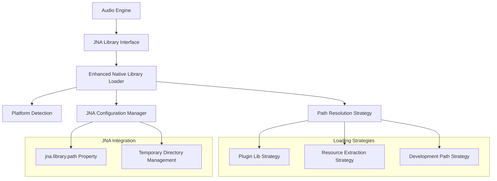

# Design Document: Native Library Loading Fix

## Overview

This design addresses the critical incompatibility between JNI and JNA library loading approaches in the music player plugin. The current implementation uses `System.load()` (JNI) to load the native library but then attempts to access it via `Native.load()` (JNA), which fails because JNA cannot locate libraries loaded through JNI.

The solution involves refactoring the library loading mechanism to be fully JNA-compatible while maintaining robust fallback strategies and cross-platform support. The design prioritizes the `jna.library.path` system property approach as the primary solution, with alternative strategies for edge cases.

## Architecture

The architecture follows a layered approach with clear separation of concerns:



The key architectural change is moving from JNI's `System.load()` to JNA-compatible approaches that allow `Native.load()` to successfully locate and bind to the library.

## Components and Interfaces

### 1. Enhanced NativeLibraryLoader

The core component responsible for JNA-compatible library loading:

```kotlin
object NativeLibraryLoader {
    private var isConfigured = false
    private var loadException: Throwable? = null
    
    @Synchronized
    fun configureJNALibraryPath(): Boolean
    
    private fun tryPluginLibStrategy(): String?
    private fun tryResourceExtractionStrategy(): String?  
    private fun tryDevelopmentPathStrategy(): String?
    
    private fun setJNALibraryPath(libraryDirectory: String)
    private fun getPlatformLibraryDirectory(): String
    private fun extractLibraryToTemp(): File?
}
```

### 2. JNA Configuration Manager

Handles JNA-specific configuration and system property management:

```kotlin
internal object JNAConfigurationManager {
    fun setLibraryPath(directoryPath: String)
    fun appendToLibraryPath(directoryPath: String)
    fun getCurrentLibraryPath(): String?
    fun validateLibraryPath(directoryPath: String): Boolean
}
```

### 3. Platform Library Resolver

Encapsulates platform-specific logic for library naming and path resolution:

```kotlin
internal object PlatformLibraryResolver {
    fun getLibraryFileName(): String
    fun getPlatformDirectory(): String
    fun getLibraryExtension(): String
    fun validatePlatform(): Boolean
}
```

### 4. Temporary Library Manager

Manages extraction and cleanup of temporary library files:

```kotlin
internal object TemporaryLibraryManager {
    fun extractLibraryToTemp(resourcePath: String): File?
    fun createTempDirectory(): File
    fun scheduleCleanup(tempFile: File)
    fun cleanupTempFiles()
}
```

## Data Models

### Library Loading Result

```kotlin
sealed class LibraryLoadingResult {
    object Success : LibraryLoadingResult()
    data class Failure(
        val exception: Throwable,
        val attemptedStrategies: List<String>,
        val errorDetails: Map<String, String>
    ) : LibraryLoadingResult()
}
```

### Platform Information

```kotlin
data class PlatformInfo(
    val osName: String,
    val osArch: String,
    val platformDirectory: String,
    val libraryFileName: String,
    val libraryExtension: String
)
```

### Loading Strategy Context

```kotlin
data class LoadingStrategyContext(
    val platformInfo: PlatformInfo,
    val pluginLocation: File?,
    val resourcePath: String,
    val developmentPath: String
)
```

## Correctness Properties

*A property is a characteristic or behavior that should hold true across all valid executions of a system-essentially, a formal statement about what the system should do. Properties serve as the bridge between human-readable specifications and machine-verifiable correctness guarantees.*

Now I need to use the prework tool to analyze the acceptance criteria before writing the correctness properties:

Based on the prework analysis, the following properties ensure the correctness of the native library loading fix:

### Property 1: JNA Library Binding Success
*For any* valid native library file and platform configuration, when the library loading process completes successfully, JNA's Native.load() should be able to locate and bind to the library functions without throwing UnsatisfiedLinkError.
**Validates: Requirements 1.1, 1.2, 1.3**

### Property 2: Loading Idempotence
*For any* number of Audio_Engine initialization attempts, the library loading mechanism should work consistently, with subsequent calls being no-ops that don't interfere with the initial successful loading.
**Validates: Requirements 1.4, 5.1**

### Property 3: Platform-Specific Path Resolution
*For any* supported platform (macOS x64/ARM64, Windows x64, Linux x64), the system should correctly resolve the platform-specific library file name and directory path according to the platform's conventions.
**Validates: Requirements 2.1, 2.2, 2.3, 2.4**

### Property 4: JNA Configuration Correctness
*For any* successful library loading, the jna.library.path system property should be set to the directory containing the native library (not the file itself), and this configuration should remain consistent across multiple loading attempts.
**Validates: Requirements 3.1, 3.2, 3.3, 3.4**

### Property 5: Fallback Strategy Execution
*For any* library loading attempt, when the primary plugin lib strategy fails, the system should sequentially attempt resource extraction and development path strategies, properly configuring JNA for each successful strategy.
**Validates: Requirements 4.1, 4.2, 4.3**

### Property 6: Comprehensive Error Reporting
*For any* library loading failure, the system should capture specific error details from each attempted strategy and provide clear error messages indicating which approaches were tried and why they failed.
**Validates: Requirements 4.4, 6.1, 6.3**

### Property 7: Loading State Management
*For any* library loading attempt (successful or failed), the system should accurately maintain and report the loading state, storing exception details for failures and providing correct status information to querying components.
**Validates: Requirements 5.2, 5.3, 5.4**

### Property 8: Debug Information Logging
*For any* library loading attempt when debugging is enabled, the system should log detailed information about library paths, platform detection, and loading attempts.
**Validates: Requirements 6.2, 6.4**

### Property 9: Temporary File Management
*For any* resource extraction to temporary locations, the system should properly mark files for cleanup on JVM exit, reuse existing temporary files when possible, and handle creation failures gracefully without leaving partial files.
**Validates: Requirements 7.1, 7.3, 7.4**

### Property 10: Explicit Cleanup Handling
*For any* temporary library files created during the loading process, the cleanup mechanism should be able to remove them when explicitly invoked.
**Validates: Requirements 7.2**

## Error Handling

The error handling strategy follows a comprehensive approach that captures and reports errors at multiple levels:

### 1. Strategy-Level Error Handling
Each loading strategy (plugin lib, resource extraction, development path) captures its specific errors and provides detailed context about why it failed. This includes:
- File system access errors
- Permission issues
- Missing files or directories
- Platform detection failures

### 2. JNA Configuration Errors
Errors related to JNA configuration are handled separately and include:
- System property setting failures
- Invalid library path configurations
- JNA library binding failures

### 3. Resource Management Errors
Temporary file and resource management errors are handled with:
- Graceful degradation when temporary file creation fails
- Proper cleanup even when errors occur during extraction
- Prevention of partial file artifacts

### 4. Aggregated Error Reporting
The system maintains a comprehensive error report that includes:
- All attempted strategies and their specific failure reasons
- Platform information and detected configuration
- Suggested troubleshooting steps based on the failure pattern

## Testing Strategy

The testing approach uses a dual strategy combining unit tests for specific scenarios and property-based tests for comprehensive coverage:

### Unit Testing Focus
- **Specific platform configurations**: Test known platform/architecture combinations
- **Error conditions**: Test specific failure scenarios like missing files, permission errors
- **Integration points**: Test the interaction between NativeLibraryLoader and RustAudioEngine
- **Edge cases**: Test scenarios like corrupted library files, invalid paths, concurrent access

### Property-Based Testing Focus
- **Cross-platform compatibility**: Generate random platform configurations and verify correct path resolution
- **Loading strategy robustness**: Test fallback behavior across various failure combinations
- **JNA configuration correctness**: Verify proper system property configuration across different scenarios
- **State management consistency**: Test loading state management across multiple concurrent attempts
- **Resource cleanup reliability**: Verify temporary file management across various extraction scenarios

### Property Test Configuration
- **Minimum 100 iterations** per property test to ensure comprehensive coverage
- **Custom generators** for platform configurations, file paths, and error conditions
- **Test tags** referencing design properties:
  - **Feature: native-library-loading-fix, Property 1**: JNA Library Binding Success
  - **Feature: native-library-loading-fix, Property 2**: Loading Idempotence
  - **Feature: native-library-loading-fix, Property 3**: Platform-Specific Path Resolution
  - **Feature: native-library-loading-fix, Property 4**: JNA Configuration Correctness
  - **Feature: native-library-loading-fix, Property 5**: Fallback Strategy Execution
  - **Feature: native-library-loading-fix, Property 6**: Comprehensive Error Reporting
  - **Feature: native-library-loading-fix, Property 7**: Loading State Management
  - **Feature: native-library-loading-fix, Property 8**: Debug Information Logging
  - **Feature: native-library-loading-fix, Property 9**: Temporary File Management
  - **Feature: native-library-loading-fix, Property 10**: Explicit Cleanup Handling

### Testing Library Selection
For Kotlin/JVM development, we'll use:
- **Kotest** for property-based testing with its comprehensive property testing framework
- **JUnit 5** for unit tests and integration tests
- **Mockk** for mocking JNA components and file system operations during testing

The combination of unit and property-based tests ensures both concrete bug detection and general correctness verification across the wide range of possible configurations and failure scenarios.